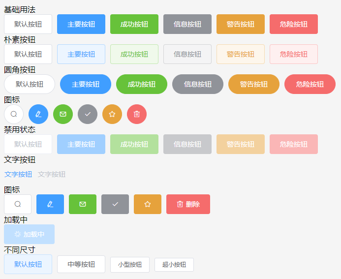

## About

element ui components from yew.



todo components:

basic
- [x] Row
- [x] Col
- [x] Container
- [x] Header
- [x] Aside
- [x] Main
- [x] Footer
- [x] Button
- [ ] Button Group
- [ ] Link

form
- [ ] Radio
- [ ] Checkbox
- [ ] Input
- [ ] InputNumber
- [ ] Select
- [ ] Cascader
- [ ] Switch
- [ ] Slider
- [ ] TimePicker
- [ ] DatePicker
- [ ] DateTimePicker
- [ ] Upload
- [ ] Rate
- [ ] ColorPicker
- [ ] Transfer
- [ ] Form
- [ ] FormItem

data
- [ ] Table
- [ ] TableColumn

## 🚴 Usage

look examples for usage.

### 🛠️ Build

When building for the first time, ensure to install dependencies first.

```
yarn install
```

```
yarn run build
```

### 🔬 Serve locally

```
yarn run dev
```


## 🔋 Batteries Included

* [`wasm-bindgen`](https://github.com/rustwasm/wasm-bindgen) for communicating
  between WebAssembly and JavaScript.
* [`wee_alloc`](https://github.com/rustwasm/wee_alloc), an allocator optimized
  for small code size.
